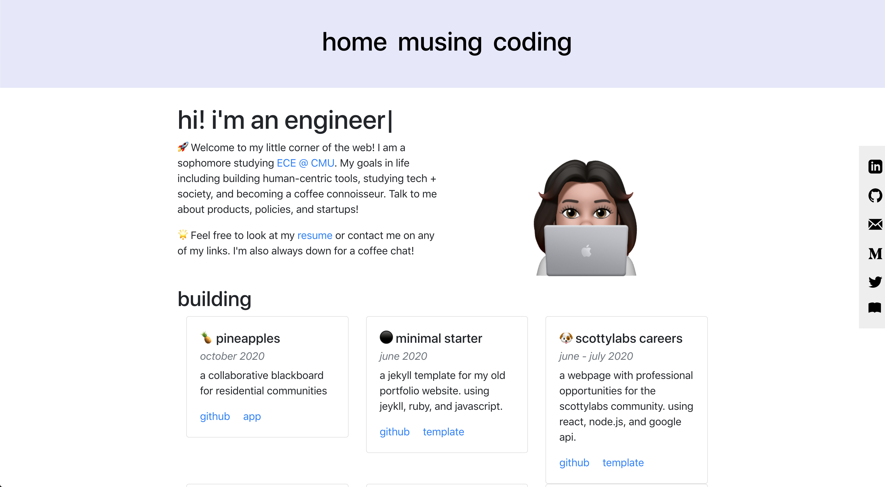
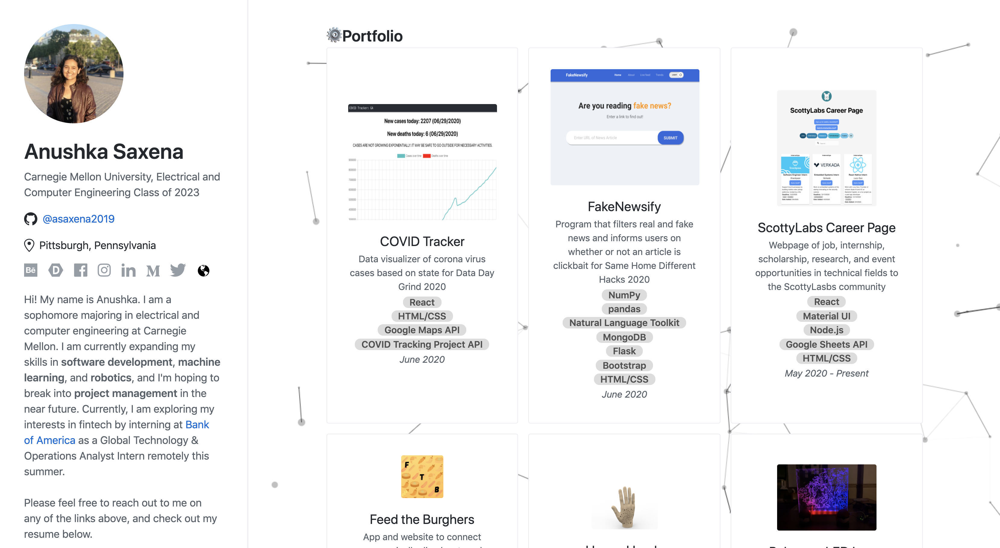
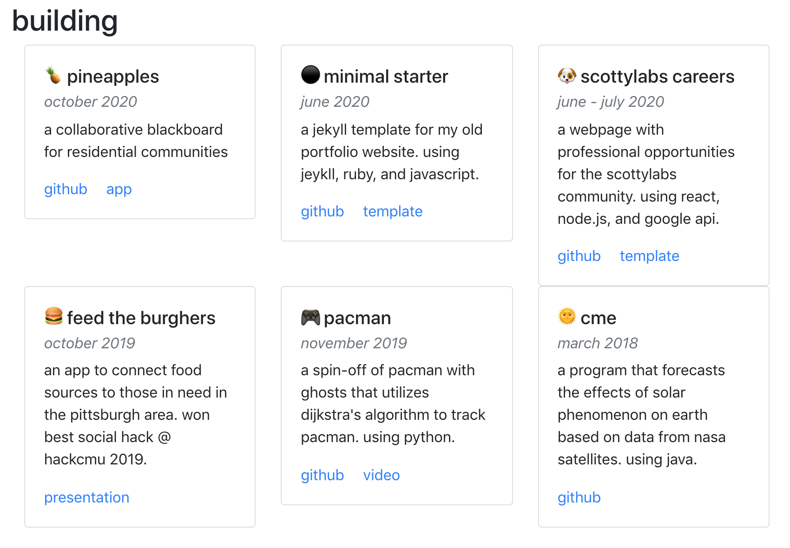
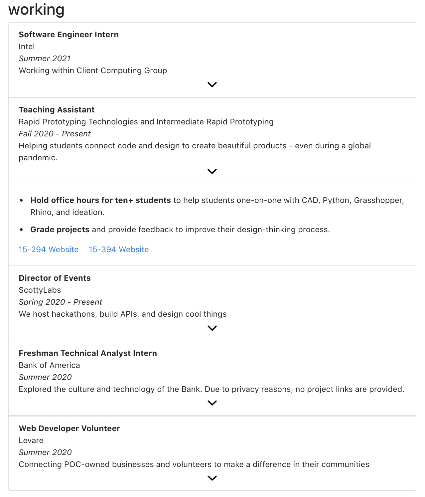
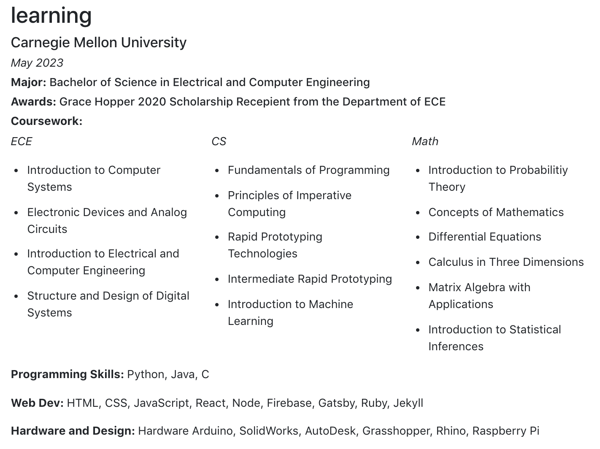
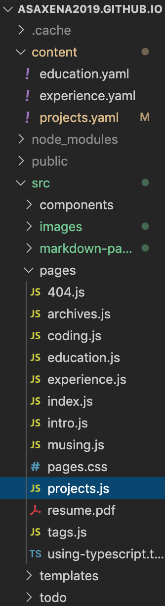
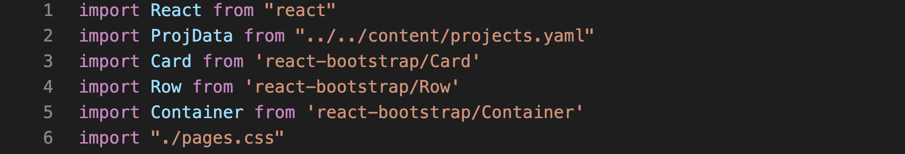
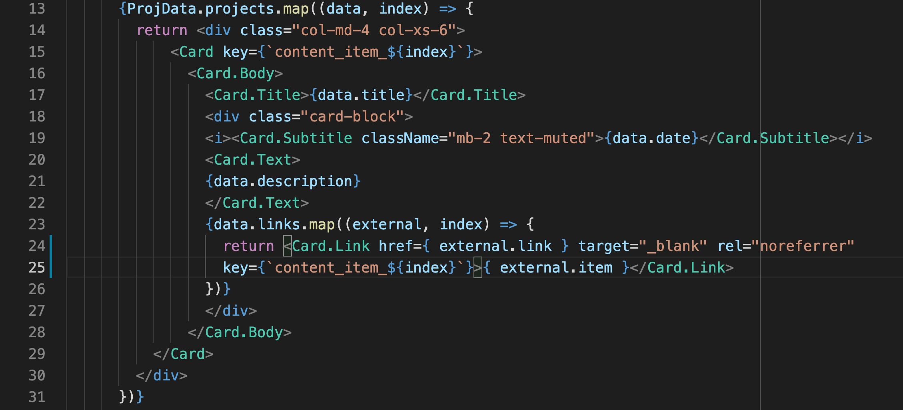

___
*“Welcome to my corner of the web!”*

What does that even mean? If you’re a college student looking for internships or someone entering a new industry, you might have heard the term “personal branding” before. It is how people will get to know you even before they formally meet you. This piece will dive into how to create a personal website to solidify your brand on the internet and ideas on what to include, but ultimately, it’s up to you to decide how you build your brand.

**

### My Attempt at Inspiration

What makes me qualified to talk about this? I’m going to be completely honest, I still haven’t fully grasped the idea. I had the most basic Common App application, had the same qualifications as a majority of applicants to software engineering roles, and did not have an impressive life story. During quarantine, I made cheesecake and learned more about full stack development and wanted to use my newfound skills to help with one of the many problems society had exposed during 2020. I also rediscovered my love for learning, which has motivated me to write, teach, and read more over the next decade. I learned more about myself and decided to start putting myself out there. My faulty yet curious “brand.” 

The way I portray this is through my website. It is an evolving body of my discoveries, defeats, and my love for my community through my ideas. It doesn’t have a theme, elaborate research publications written on there, or the next great startup idea on display (yet). But, it is an embodiment of who I am and what I’m learning next. 

### How Not to Start

One of the pitfalls that I ran into was not knowing how to start. I went through periods of being too ambitious to be burnt out by all the ideas in my head and not wanting to do anything. I would see all these cool graphics and designs online and would try to incorporate them into my website for hours with no avail. Remember, you can always change it and add new features over time. The hardest part is to get started :)

**

### Using Gatsby 

You can check out part I, II, and III of my guide if you want a basic understanding of web development. One of the frameworks I mention is Gatsby and is what I used to create my website. Gatsby is based on React, a popular JavaScript framework that makes it easy to create fast websites. Gatsby provides many boilerplates to use to start your websites, and most of them come with blogging capabilities. I decided to start my website from scratch to have the most control over what I can put and what I can exclude. It’s also easier to define my own style without being bogged down by previously set CSS. 

To get started, first download the template from their Github page. You can do this by running the command:

```
gatsby new <insert-website-name> https://github.com/gatsbyjs/gatsby-starter-default
```

Once you do that, run this from your terminal:

```
gatsby develop
```

You will see this page at port 8000 on localhost:

**

As you can see, there isn’t a lot on there yet. However, there are lots of resources out there to start. One of the most popular frameworks for HTML, CSS, and JavaScript is [Bootstrap](https://getbootstrap.com/), and for my website, I used the [React version of it](https://react-bootstrap.github.io/). There are many components such as buttons, figures, cards, navigation, etc., and their websites have detailed documentation on how you can customize them to your tastes. If these don’t satisfy your style, you can also check out other frameworks such as [Material UI](http://material-ui.com/) or [Semantic UI](https://semantic-ui.com/). If you have a specific component in mind but can’t find them in a specific framework, you can always Google them and find [open source components](https://github.com/brillout/awesome-react-components). 

### The -ings

As a student and aspiring software developer, I want my website to display all facets of my professional and school career. Therefore, the three sections on the homepage on my website are building, working, and learning. AKA projects I’ve built, places I’ve worked at, and subjects I’ve studied. Again, whatever you include and how you present it is up to you. 

#### building

Out of everything, I am most excited to display my projects. This is where I display my pure passions. They include club, school, and personal projects, ranging from [catering websites] to a [spin-off of a classic game]. I might add a freelancing tab later on.

I used [cards](https://react-bootstrap.github.io/components/cards/) to display information about my projects, including title, description, and links, but other viable components are [accordions](https://react-bootstrap.github.io/components/accordion/), [flipping cards](https://reactjsexample.com/flipping-cards-for-your-react-projects/), and [list groups](https://react-bootstrap.github.io/components/list-group/). 

Other features that could be added are tools used in the project, images, and live demos of the projects.

**

#### working

Displaying my work, extra-curricular, and volunteer experiences will hopefully give insights to employers about how I work in professional settings. I included those three types of experiences because I am new in my career, and everything I do, whether paid or unpaid, can show my skills in different areas. Trying my best to sell myself as much as I can.

I used [accordions](https://react-bootstrap.github.io/components/accordion/) to display information about my projects, including companies, titles, dates, descriptions, and links, but other viable components are [cards](https://react-bootstrap.github.io/components/cards/), [jumbotrons](https://react-bootstrap.github.io/components/jumbotron/), and [list groups](https://react-bootstrap.github.io/components/list-group/). I knew there would be more information with this section, and I didn’t want to inundate the view with words on a screen. I also didn’t want this section to look exactly like my Linkedin experience section. Therefore, the accordion allows the viewer to open whatever experiences they are interested in. Other features that could be added are company logos, contact information, and links to projects (if legal).

**

#### learning

Since I am a college student, most people will also be interested in where I go, when I graduate, and what I’m studying. I also included what classes I am taking, what skills I have gained, and awards I have won. I didn’t include high school information, since that is already on my Linkedin page, but I might switch the two soon.

I used plain text to display the information. Other components that could be used are [accordion](https://react-bootstrap.github.io/components/accordion/) (if you’re displaying multiple educational institutions or degrees), [list groups](https://react-bootstrap.github.io/components/list-group/), or [timelines](https://reactjsexample.com/tag/timeline/). Other features that could be included are pictures from your school or any quotes from your teachers or professors about you.

**

### Ain’t Markup Language

[YAML](https://yaml.org/) is an easy way to serialize data. I use it for the sections above so that it’s easy to add and delete information in a structured way with predetermined formatting to reduce copying and pasting div sections.

YAML is so easy to use, you don’t even need a plugin to use it on your Gatsby website because Gatsby treats YAML data like an array. Thus, you can use the JS map function on it. You can check out the full instructions [here], but all you have to do is save all your YAML files in a specific folder, import it into the page you are using the data in, and use the mapping function similar to the one below.

**

**

**

### Embellish!

Now that you have a front page, you can add other sections, tabs, themes, etc. I also added a sidebar with all my socials so that it’ll always be accessible. I also added two other tabs, coding and musing, which I will discuss later in this which documents my daily programming log and my blog. Other cool ideas that I might implement later and you could steal are research publications, bookmarks, live Twitter feed, mini games, data visualization of your website analytics...the list goes on and on. Whatever you do, more power to you! 

Notice how I still have many ideas on what I can add and how I can improve. That’s the power of having your own evolving website and building from scratch. Reach out to peers and mentors to get iterative feedback if you’re conflicted about what to include or how it’s presented. But at the end of the day, you’re in control of your corner of the web.
___