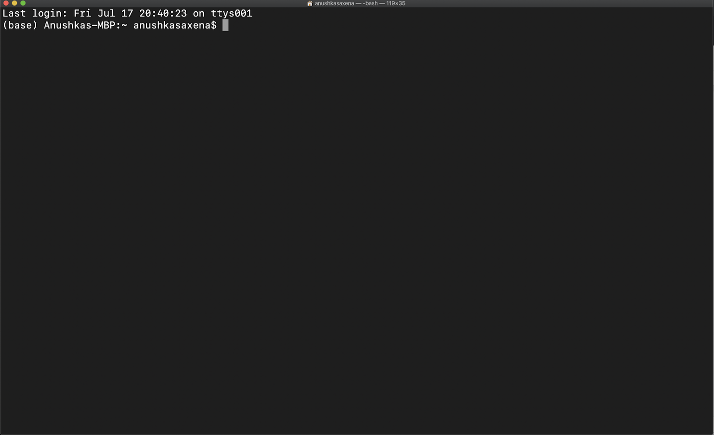
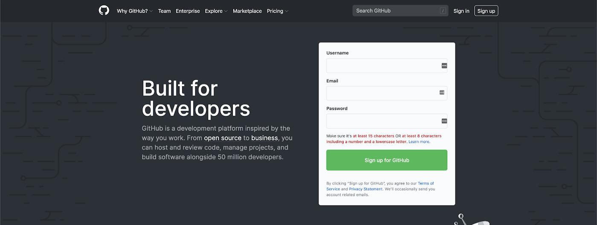
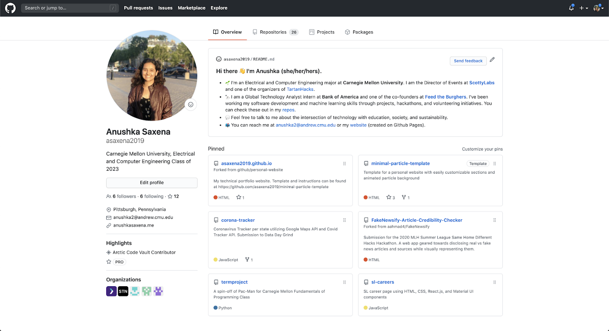
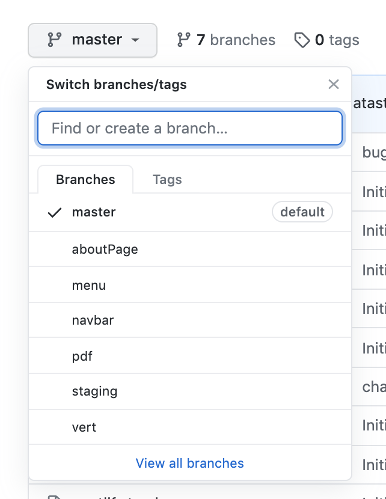

___

*Notes: This article can also be found in [The Startup](https://medium.com/swlh/foundations-of-web-development-series-part-i-git-basics-f35ecfffe26b).*

___

*This guide was developed for web developers at [Levare](http://levareorg.com/), a volunteer initiative meant to amplify the Black community by helping Black-owned businesses create an online presence.*

Hi! 👋The purpose of this guide is to lay out the foundations for what you need and where to start; as far as the actual coding, I provide a few resources, but the rest is up to you.

### Definitions
As defined by its website, [**Git**](https://git-scm.com/) is a **distributed version control system**. Let’s break that down.

**Distributed** means that the codebase can be shared across multiple users, and the users can work on a) making changes to the code on their **local** repository or b) making changes to the code and sharing the changes across all the users on a **remote** repository. A **repository** is your entire project: all files, folders, images, code, etc., are needed to run or understand your project.

Your **local** repository contains only YOUR versions of the code, including your own branches. If you make any changes to your  repository, you will not be able to access anyone else’s code, nor will they have access to your code. When working with your local repository, you will most likely be working with the **command line**, a set of instructions that view, handles, and manipulates files. Depending on what operating system you are using, you can access the command line using Mac Terminal, Windows Command Prompt, or Linux Shell.

**

BE EXTREMELY CAREFUL WITH YOUR COMMAND LINE! It communicates directly with the computing system, and if you run the wrong series of commands, you can definitely change (or even destroy) your system in ways that you may not like. We will be going over a few commands related to Git, but I strongly encourage you to visit the [Missing Semester of CS](https://missing.csail.mit.edu/).

The **remote** repository is where you can upload your code after you are done testing it on your local system. Here, other people can get your code and collaborate with you, depending on whether you set your repository to be public or private. The most common remote repository and the one that many companies use is [**Github**]
(https://github.com/).

**

I highly recommend that you create an account. There are a ton of resources available on different repositories, and if you are new to Git, there are a ton of open source applications that walk first-time contributors through the process. You can check out a good list [here](https://github.com/up-for-grabs/up-for-grabs.net).

**

**Version** means that a user can save the history of the code changes through **commits**. In my opinion, this is the best and most important part of Git.

Think about it like this: you’re working on a paper for your writing class, and you start off with a rough draft. This is your FIRST (and hopefully not last :p) version of the paper. Let’s say that you want to share this paper with two of your friends, and they make edits to your paper. This makes it the SECOND and THIRD version of the paper. While your friends are editing the paper, you decide to change the title of your paper and add another paragraph, but your friends don’t have this version to edit. Now you have the FOURTH version of your paper. You receive the paper that your friends edited, and you combine everything you have right now to submit. This is your FIFTH version But wait — you remember that there was this source you wanted to use, but you don’t remember from which version you saw it in. Now you have five different versions of the same paper on your desktop, and everything is falling apart and it’s the end of the world.

With Git, it’s much easier to keep track of all the versions you have through and who contributed to what version. You can keep track of versions with different features, multiple contributors, etc.

**Control** means that the user can save the codebase in different places and determine where to apply the changes. This way, you can distinguish between your “rough” and “final” copies of the code in a more distinct manner with branches and forks, and you can determine what changes should be applied.

A **branch** contains a version of your code. You typically start with the **master** branch, aka the main branch. In most cases, your final code will also reside in this branch. Some projects will rename its master branch to the **production** branch to indicate that this branch’s code is being actively deployed elsewhere. We will cover deployment later. Another common branch is **staging**, a branch to test your product on your remote repository. We have a staging branch for our website to test our features and see if everything is properly deployed.

**

Let’s say you are building a website, and you want to integrate a search function, but you’re not sure if you want to incorporate it into the final product yet. You can create a branch from that moment in your code’s history and call it to search. While you are working on the search branch, the code on that branch will not be affected by any changes in the master branch, nor will the master branch be affected by any changes in the search branch. Once you are satisfied with this branch, you can **merge** it with the master branch, **check out** the master branch, and continue making changes to the master branch.

To further our example, let’s say you continue making changes to the master branch and want to go back to the search branch and change something on there. If you go back to that branch, you will NOT be able to see any of the new changes unless you **pull** the code from the master branch. Otherwise, your code will look exactly like it did since the last time you accessed that branch.

Branches are typically used to track the history of different features. Some projects will use branches to distinguish between versions from different contributors, but there is another feature that can also achieve that: **forks**. Users can copy the codebase across different remote repositories with forks. From whatever point in time a user forks a repo, that user will have access to all the files and versions from the original repository. Any changes that the user makes on their forked repository, however, will again not affect the original repository, and the same applies vice versa. Forks can also be merged.

**

### Basic Commands

Instructions on how to install Git-based on your operating system can be found [here](https://git-scm.com/book/en/v2/Getting-Started-Installing-Git). In most cases, it’s as simple as running one command on the command line.

If you Google “git”, you will come across many different commands and be overwhelmed by the power of Git. However, I’ve usually been able to get away with the basics down below. If a command starts with git, it’s a command specific to git. If not, it’s a command that can be used universally.

```
ls
```
Lists all the files and folders within that directory
```
cd <location-of-project>
```
Enters that directory
```
cd ..
```
Goes to the encompassing directory
```
mkdir
```
Creates a directory
```
git init
```
Initializes a Git for your project. May also reinitialize, if the project already has a Git repo
```
git pull <remote-repo-name> <remote-branch-name>
```
Pulls changes from the remote repository
```
git merge <branch-name>
```
Merges changes from a specified branch into the current branch
```
git add <file-name>
```
Adds indicated files to the staging area. Does not add the changes to history
```
git add .
```
Adds all the changed files to the staging area. Does not add the changes to history.
```
git commit -m “add message”
```
Commits the changes in the files in the staging area to the history
```
git push <remote-repo-name> <remote-branch-name>
```
Pushes the commits to the specific branch on the specific remote repo
Typically, the previous three commands are used in sequence whenever a user wants to commit a feature.
```
git remote add <remote-name> <remote-link>
```
Adds a remote repository to the local project
```
git branch -a
```
Lists all the local and remote branches available
```
git branch <branch-name>
```
Creates a new branch from the current branch
```
git checkout <branch-name>
```
Checks out the specific branch
```
git clone <repository-link>
```
Clones repository on the local repository

Thank you for reading! Part II and III will be released soon. Please let me know if I should add anything. You can find me on [Twitter](http://twitter.com/c0ffeec0ders) or [Linkedin](https://www.linkedin.com/in/anushka-saxena-b40aa2165/).
___