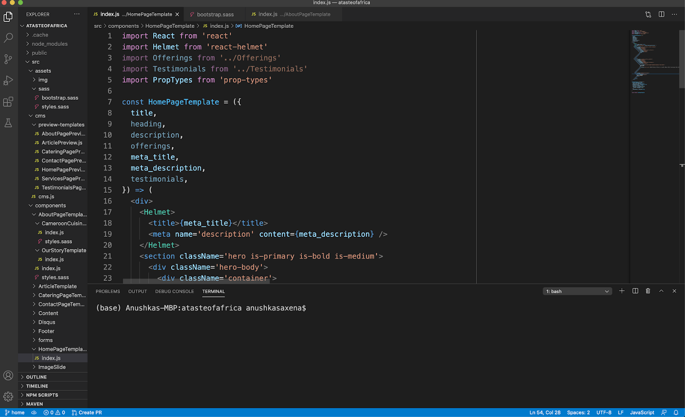
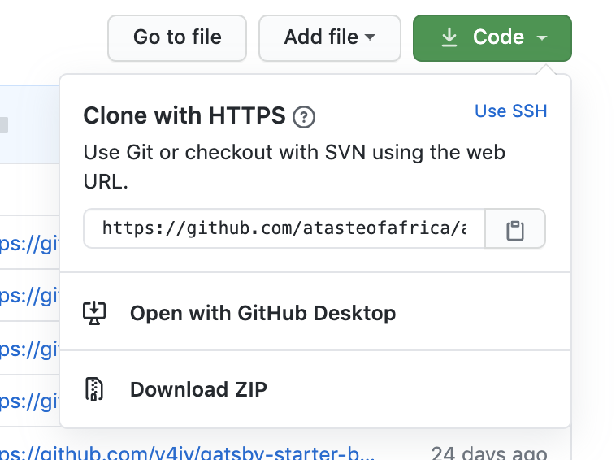
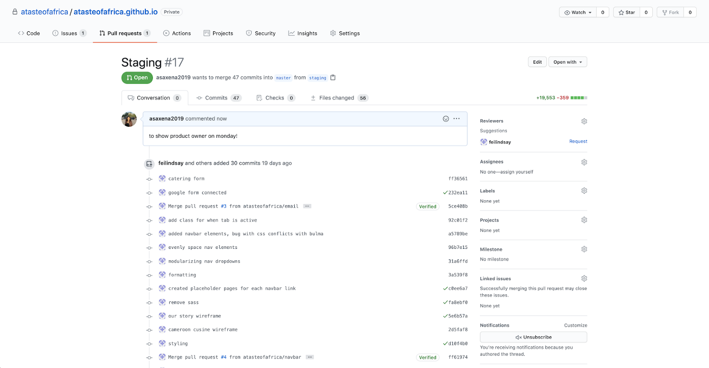
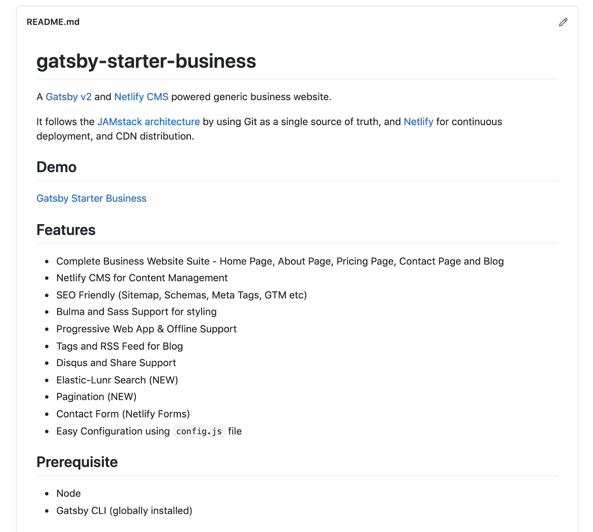

___

*Notes: This article can also be found in [The Startup](https://medium.com/swlh/foundations-of-web-development-series-part-ii-creating-your-website-8c1f29a1d13a).*

___

*This guide was developed for web developers at Levare, a volunteer initiative meant to amplify the Black community by helping Black-owned businesses create an online presence.*

### Package Managers

When starting with web development, you’re going to run into many dependencies that will most probably not already be installed on your computer. The **node package manager** allows you to install these JavaScript packages in your projects so that you can use them. For more  and to install, check out [their website](https://www.npmjs.com/). **Yarn** also allows you to install packages, and you can find more information and installation [here](https://yarnpkg.com/). I recommend installing both so that you won’t run into issues in the future.

### Editing Code

A **code editor** allows you to edit, run, and debug your code. You will need to install a code editor to start developing your code. A popular code editor is [Atom](https://atom.io/), created by Github. It has Github Integration, which makes it easy to work with the Git workflow. Another popular one and the one I use is [VSCode](https://code.visualstudio.com/), created by Microsoft. I like it because of the style, but either is fine.

**

Once you open your project folder, you’ll be able to see all your projects on the left side of your screen by pressing the top left icon on the sidebar. You will also be able to open the command prompt on the bottom of your screen so that you can run commands. On Mac, you can do this by pressing the “Terminal” option on the Menu bar and pressing “New Terminal.”

**


### Starting a Website from Scratch or a Template

If you are planning on going down this route, congrats! You will be taking on an enormous feat, but it will be a rewarding experience. There are two aspects of all websites: front-end and back-end. You can develop websites with front-end only, but adding a back-end will allow the user to do a lot more.

#### Front-end

**Front-end** involves all the parts of the website that you can see and interact with. **Static websites** are websites that do not change from user to user. There are no databases involved, and the user is limited in its interactivity with the website. All static websites have three basic components: HTML, CSS, and JavaScript. There are a ton of resources that can help you start with building from scratch.

- [W3Schools](https://www.w3schools.com/) covers the basics of HTML, CSS, and JavaScript. They also have tutorials for almost every conceivable component, so it’s a great reference.

- [freeCodeCamp](https://www.freecodecamp.org/) also offers many guides and certifications in all areas of web dev. They also have a great [Youtube channel](https://www.youtube.com/channel/UC8butISFwT-Wl7EV0hUK0BQ) where they walk through how to build entire web projects in a few hours.

- [Bootstrap](https://getbootstrap.com/) offers great templates and components in pure HTML, CSS, and JavaScript. Definitely recommend it if you are starting from scratch and want to play around with different components and see how everything fits in together. Bootstrap also has a [CSS grid system](https://getbootstrap.com/docs/4.0/layout/grid/) that is widely used to build responsive websites.

- [React](https://reactjs.org/) is a JavaScript framework that allows you to build beautiful user interfaces. It also allows you to easily reuse components.

- [React Bootstrap](https://react-bootstrap.github.io/) takes Bootstrap components and React-ifies them. Again, easy to reuse components and alter them as you need, especially if you are already familiar with Bootstrap.

- [The Net Ninja](https://www.youtube.com/channel/UCW5YeuERMmlnqo4oq8vwUpg) offers great Youtube tutorials in a wide variety of fields.

- [Gatsby](https://www.gatsbyjs.org/) creates static websites with React. There are already tons of templates available on the website, but make sure you are following the instructions on how to download and install the [Gatsby command line program](https://www.gatsbyjs.org/tutorial/part-zero/).

#### Back-end

**Back-end** helps power everything that is going behind the screens of your website. It helps define data architecture and business processes and run application programming interfaces, or APIs, which takes care of data requests. Like front-end, there are a ton of back-end resources, but some are more compatible with certain front-end frameworks than others.

- [Node.js](https://nodejs.org/en/) is a back-end runtime environment that uses JavaScript outside a web browser. It’s usually paired with React as a frontend framework.

- [Express](https://expressjs.com/) is another back-end framework that is built upon Node and makes it easier to build back-end functionalities. I would highly recommend checking out Net Ninja’s tutorials on these two frameworks.

- [GraphQL](https://expressjs.com/) is a query language for APIs that you can use alongside your back-end systems to retrieve data according to your taste. GraphQL powers lots of Gatsby templates, so it may be something to look into if you plan on using Gatsby.

Another really cool API that you could use is the [Google Sheets API](https://developers.google.com/sheets/api). This API allows you to take information from a Google Sheet that you create and use it on your website. You can also use this API to allow users to input information on your website, which will then show up on your sheet. If you are new to databases and back-end functionalities, I highly recommend looking into using this API to power your website. If you want to connect your Google Sheets API to your Gatsby website, I recommend checking out [this article](https://medium.com/@iliashaddad/how-to-build-a-gatsby-website-with-google-sheets-7dc292af537e).

### Contributing to Ongoing Website

If you are joining a team (like Levare!) and are planning on contributing to ongoing websites, you can easily:

- **Fork** the remote repository using the fork option on top of the repository.

- Contribute to separate **branches** within the repository by creating new branches both remotely and locally

With both of these options, you don’t need to worry about what is happening with the original repository or branch, as nothing will happen to that branch until you merge. Once you’ve decided where to place your remote repository, make sure you clone the repository on the local repository using
```
git clone <repository-link>
```
You will be placed on the master branch after you clone your repository, so make sure you check out the right branch once you start developing. By default, your remote repository is now named origin on you local.

**


After cloning a repository, make sure that you install all the necessary packages for that project. They will almost always be in the **package.json** folder, and you will want those in your respective files as well. You can do this by running
```
npm install — save
```
on your terminal.package.json file that lists all the dependencies for the projectOnce you get your local repository downloaded, read the **README**! Most well-documented repositories will tell you specifically how to run and test your code on their READMEs, but here are some ways you can run common frameworks:

- Vanilla JS: Open the HTML file on your web browser! It will update in real-time

- React: 
```
npm start
```
- Gatsby:
```
gatsby develop
```
- Node:
```
node <file-name>
```
- GraphQL: runs automatically with Gatsby, and you can check out how it works at
```
http://localhost:8000/___graphql
```

READMEs can also give you information on how to edit components, especially if there are unique components involved in your project. Otherwise, you can depend on your awesome teammates to teach you! My co-volunteer Lindsay Fei created this awesome [guide](https://docs.google.com/presentation/d/19jko7q2naFV6apNbrYB9khDAfjUS-1BJzfjZHIfyTQA/edit#slide=id.g8d8780cd2d_0_0) on how to edit components on our own website for the business we are helping. I highly recommend checking it out if you want to learn how to develop cool components like forms and work with [Chrome Dev Tools](https://developers.google.com/web/tools/chrome-devtools).

**


### Working with Others

Whenever you start working, I recommend pulling from the remote branch. You can do this by running
```
git pull <remote-repo-name> <remote-branch-name>in your terminal.
```
That way, you’ll also always have the updated code.Whenever you’ve made significant progress, make sure you remember to **commit** your changes and **push** to your remote repository. That way, everyone on your team always has the most updated version of the code.

If you are ready to merge your branch or fork with the main branch or repository on Github, then you have to make a **pull request (PR)**. PRs incorporate the changes you have made to your code to the source that you are contributing to. Most projects require approval from the collaborators so that unwanted changes aren’t made to the main codebase, so PRs are another way to control code.

**

After you make a PR, Github will tell you if the two branches are able to be merged properly with their own checks. After you merge, I recommend pulling the code from the merged branch and testing it on your local to ensure there are no errors.

Branches will be able to successfully merge

If you’re contributing to a specific branch or a fork or even your own project, make sure you create a good README so that future contributors will have an easy time working with your code. If you need help getting started, check out [this website](https://www.makeareadme.com/).

**

If you have issues on your website that you are not able to figure out, you can always open an issue on the Issues tab on your Github repository. Contributors can look at these issues and help you find potential solutions.

Thank you for reading! Part I can be found [here](https://medium.com/swlh/foundations-of-web-development-series-part-i-git-basics-f35ecfffe26b) and III will be released soon. Please let me know if I should add anything. You can find me on [Twitter](http://twitter.com/coffeecoders1) or [Linkedin](https://www.linkedin.com/in/anushka-saxena-b40aa2165/).
___