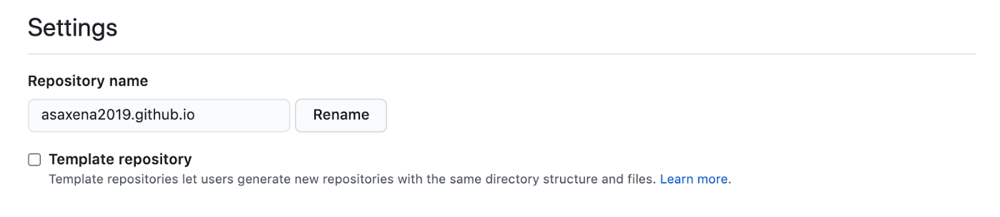
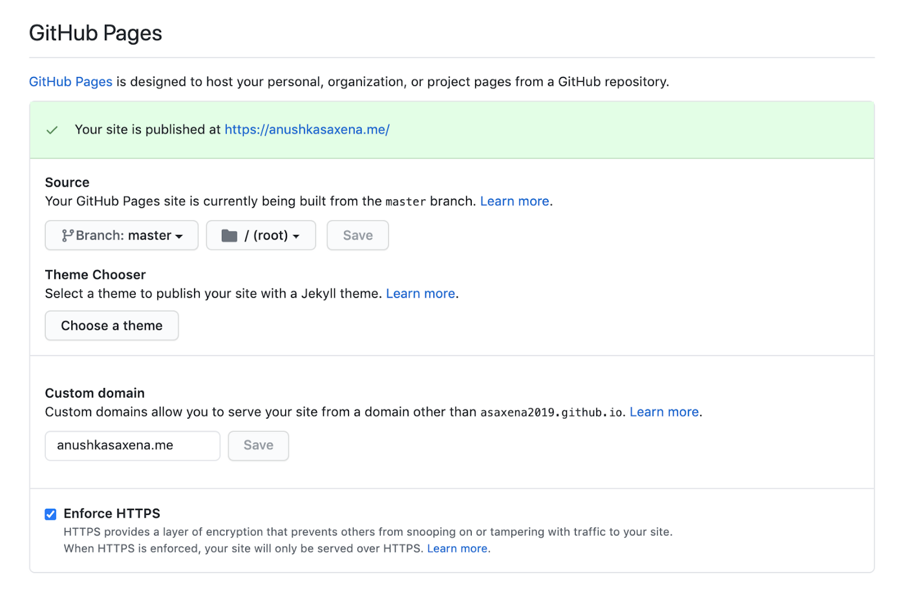
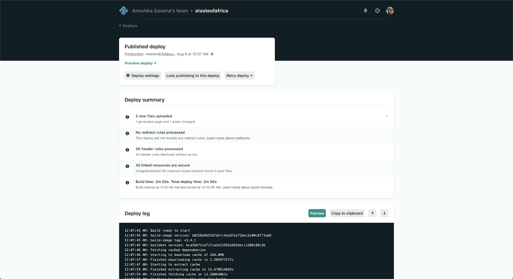
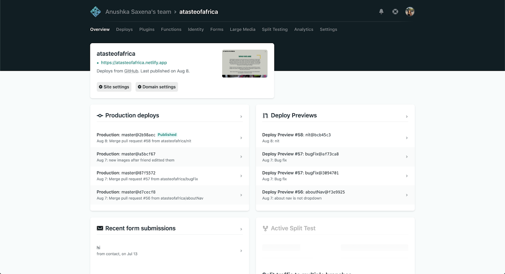

___

*Notes: This article can also be found in [Weekly Webtips](https://medium.com/weekly-webtips/foundations-of-web-development-series-part-iii-deploying-your-website-c3f3e3360059).*

___
*This guide was developed for web developers at [Levare](http://levareorg.com/), a volunteer initiative meant to amplify the Black community by helping Black-owned businesses create an online presence.*

### Ready for Production

After you have made all your commits and merged all your PRs, it’s time to merge everything to your **master** or your **production** branch. This is the branch where all your source code for your website will be and where you will deploy it. If you are not confident about deploying from your production branch yet or would like to see how your website looks as you develop it, you can also set up deployment on your **staging** branch so that you can see what you’re presenting to your client before giving them the final product.

### Deployment

When you run your code on your computer, only you are able to see the website on your local computer. If you want the rest of the Internet to have access to your website, you will need to host and deploy your website. For front-end and back-end, there are different deployment methods, depending on what frameworks you used for your code.

#### Front-end

You can host your website on Github for free, but deployment is usually pricey. Luckily, there are a few free and easy-to-use deployment methods.

##### Github Pages

[**Github Pages**](https://pages.github.com/) allows every user on Github one personal static website and a page for every repository you have. Changes made to your repository will be automatically reflected on your website. This is great if you do not want to use any tools outside of Github.

To set up, the main thing you need to know is that when you create your remote repository, the name of your project must be [yourusername].github.io, where [yourusername] is your Github account’s username. You will be able to access your website using the same URL.

**

If you want to configure your settings so that you can deploy from another branch, change the domain, pick a theme for your website, or enforce HTTPS, you can scroll to the bottom and change the [publishing settings](https://docs.github.com/en/github/working-with-github-pages/configuring-a-custom-domain-for-your-github-pages-site).

**

Github Pages is mainly used to deploy pages that utilize Jekyll or pure HTML. If you are creating websites with React or Gatsby, Netlify is a better option.

##### Netlify

[**Netlify**](https://www.netlify.com/) takes advantage of **continuous deployment**. You can connect your Github repository to your Netlify account, and whenever you push changes to your repo, Netlify will automatically deploy those changes on your website.

Netlify will also be able to determine how to **build** your website. For example, Gatsby’s build command is gatsby build, and React’s build command is npm build. These commands are automatically determined and executed by Netlify, but if you have any other special commands in order to build, you can change it in the Build & deploy settings.

**

Once you create your account and go through the steps of setting up deployment, you will be able to see logs, configure domains, and secure your website all in one place.

**

##### Which one?

Unlike a code editor, you have to look into the difference between each hosting website and determine what’s better. If you want to check out the differences between Netlify and Github Pages, you can visit [this website](https://www.netlify.com/github-pages-vs-netlify/#:~:text=If%20you%20are%20hosting%20a,easy%20to%20deploy%20your%20site.&text=Netlify%20works%20out%20of%20the,your%20Git%20repo%20to%20Netlify). It is biased, but I definitely support Netlify. They support continuous development and more builds per hour than Github Pages, but the perfect hosting platform for you will ultimately depend on how often you will be updating your project and what languages you are using.

#### Back-end

If you are using Node.js or Express back-end, you can use [Heroku](https://www.heroku.com/) to deploy your code. This won’t deploy your entire website, as you need to connect your front-end to your back-end. If you are using Netlify, you can use [this article](https://dev.to/lindakatcodes/a-beginners-guide-to-hosting-an-app-with-heroku-and-netlify-8i5) to figure out how to connect the two sides.

If you are using GraphQL with Gatsby, it will automatically work once you host the website.

### Buying and Configuring a Custom Domain

When using Github Pages or Netlify, your domain will end with .github.io or .netlify.app. These not only make your domain long, but it also takes away from the brand you are trying to develop. You can purchase a domain from many websites, such as the ones listed below. They mainly differ in price and additional features such as security, so pick the service that’s best for you.

- Domain.com: https://www.domain.com/
- Namecheap: https://www.namecheap.com/
- GoDaddy: https://www.godaddy.com/
- Bluehost: https://www.bluehost.com/

After buying your domain, visit [this website](https://docs.netlify.com/domains-https/custom-domains/) to learn how to add your custom domain to your website on Netlify or [this website](https://docs.github.com/en/github/working-with-github-pages/configuring-a-custom-domain-for-your-github-pages-site) to learn how to add your custom domain to your website on Github Pages. You can also Google “(domain provider) and (hosting website) configure a custom domain.” For example, if you are using Netlify and Namecheap, you can go to [this website](https://dev.to/easybuoy/setting-up-domain-with-namecheap-netlify-1a4d) to figure out how to configure your custom domain. Additionally, if you are a student and have Github accounts, you can get free domains and other tools with your [Student Developer Pack](https://education.github.com/pack).

Thank you for reading! Part I can be found [here](https://medium.com/swlh/foundations-of-web-development-series-part-i-git-basics-f35ecfffe26b) and Part II can be found [here](https://medium.com/@coffeecoders/foundations-of-web-development-series-part-ii-creating-your-website-8c1f29a1d13a). Please let me know if I should add anything. You can find me on [Twitter](http://twitter.com/c0ffeec0ders) or [Linkedin](https://www.linkedin.com/in/anushka-saxena-b40aa2165/).
___